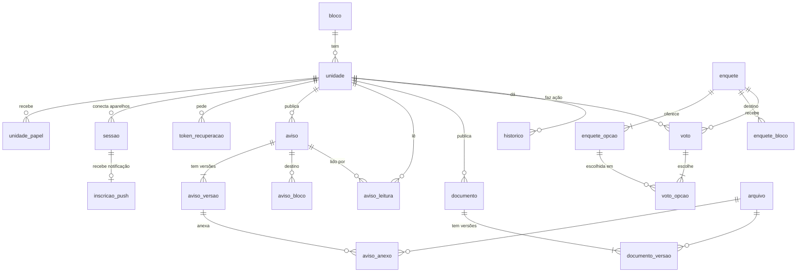

# 04 · Modelo de dados — Entrega 1

| | |
|---|---|
| **Status** | v0.1 |
| **Autor** | Erick Santos Dantas |
| **Criado em** | 02/10/2026 |
| **Base** | `03-historias.md` v0.1 (somente E1) |
| **Próximo documento** | `05-arquitetura.md` + ADRs |

---

## 1. Premissas

- Banco **relacional (PostgreSQL)**. A escolha formal e a hospedagem ficam num ADR do documento
  de arquitetura. Aqui, os tipos já são os do Postgres.
- **Chaves:** `bigint` gerado pelo banco (`generated always as identity`). Segredos (sessão,
  recuperação de senha) são tokens aleatórios guardados **só como hash**.
- **Datas:** sempre `timestamptz` (com fuso). O banco guarda em UTC e a tela mostra no horário
  de Recife (`America/Recife`).
- **Arquivos** (PDFs, imagens) ficam num serviço de armazenamento, **fora do banco** (RNF-22).
  O banco guarda só os metadados e a chave do arquivo.
- **Nomes** em português, minúsculos, no singular (`unidade`, `aviso`), como no restante dos
  documentos.
- Só entra aqui o que a **E1** precisa. Reservas, chamados e o resto ganham tabelas quando a
  entrega deles começar. Até lá, o modelo não deve ser adivinhado.

## 2. Diagrama

## 3. Tabelas

### 3.1 Unidades e acesso

**`bloco`** — os 5 blocos (H-10)

| Coluna | Tipo | Regra |
|---|---|---|
| `id` | bigint | PK |
| `numero` | smallint | único, 1–9. É o primeiro dígito do login. |
| `nome` | text | ex.: "Bloco 3" |
| `ativo` | boolean | padrão `true`. Bloco não é apagado, só desativado. |

**`unidade`** — uma linha por apartamento **e** a conta de acesso dele (RF-01, RF-03)

| Coluna | Tipo | Regra |
|---|---|---|
| `id` | bigint | PK |
| `bloco_id` | bigint | FK `bloco` |
| `numero` | text | 3 dígitos, ex.: `'502'`, `'007'`. Único dentro do bloco. |
| `andar` | smallint | 0 = térreo … 7 |
| `login` | text | **único**. `bloco.numero` + `numero`, ex.: `'1101'`. Gerado pelo banco. |
| `ativa` | boolean | padrão `true`. Desativar em vez de apagar (H-10). |
| `senha_hash` | text | hash **Argon2id**. Nunca a senha. |
| `precisa_trocar_senha` | boolean | `true` enquanto estiver com `mudar123` (H-01) |
| `ativada_em` | timestamptz | nulo = "não ativada". Preenchido ao concluir o 1º acesso. |
| `responsavel_nome` | text | **dado pessoal** · obrigatório após ativar |
| `celular` | text | **dado pessoal** · obrigatório após ativar |
| `email` | text | **dado pessoal** · opcional |
| `tentativas_falhas` | smallint | zera no login certo (H-03) |
| `bloqueada_ate` | timestamptz | nulo = livre |

> **Por que a conta mora na própria `unidade`:** a decisão de 02/10/2026 é "uma conta por
> unidade". Uma tabela `usuario` separada só existiria para permitir várias contas por unidade,
> o que foi descartado. Se um dia mudar, a migração é criar `usuario` e mover estas colunas.

**`unidade_papel`** — quem tem poder de gestão (RF-09, H-09)

| Coluna | Tipo | Regra |
|---|---|---|
| `id` | bigint | PK |
| `unidade_id` | bigint | FK `unidade` |
| `papel` | enum `papel` | `admin`, `comissao`, `sindico`, `conselho` |
| `concedido_em` / `concedido_por` | timestamptz / FK `unidade` | |
| `retirado_em` / `retirado_por` | timestamptz / FK `unidade` | nulo = papel em vigor |

Papel não é apagado ao ser retirado: a linha recebe `retirado_em`. Assim se sabe quem foi da
Comissão e quando. Restrição: **um papel em vigor por tipo por unidade** (índice único parcial
`where retirado_em is null`).

**`sessao`** — cada aparelho conectado (H-02, H-06)

| Coluna | Tipo | Regra |
|---|---|---|
| `id` | bigint | PK |
| `unidade_id` | bigint | FK `unidade` |
| `token_hash` | text | único. O aparelho guarda o token; o banco, só o hash. |
| `aparelho` | text | descrição curta tirada do navegador, ex.: "Android · Chrome" |
| `criada_em` / `ultimo_uso_em` | timestamptz | |
| `encerrada_em` | timestamptz | nulo = conectada. Sair, desconectar ou resetar preenche. |

**`inscricao_push`** — para onde mandar a notificação (H-05, H-13)

| Coluna | Tipo | Regra |
|---|---|---|
| `sessao_id` | bigint | PK e FK `sessao`. Uma por aparelho. Some quando a sessão é encerrada. |
| `endpoint`, `chave_p256dh`, `chave_auth` | text | dados do padrão Web Push |

**`token_recuperacao`** — "esqueci a senha" por e-mail (H-04)

| Coluna | Tipo | Regra |
|---|---|---|
| `id` | bigint | PK |
| `unidade_id` | bigint | FK `unidade` |
| `token_hash` | text | único |
| `expira_em` | timestamptz | 1 hora após criar |
| `usado_em` | timestamptz | nulo = ainda não usado. Uso único. |

### 3.2 Arquivos

**`arquivo`** — metadados do que foi enviado (RNF-22)

| Coluna | Tipo | Regra |
|---|---|---|
| `id` | bigint | PK |
| `chave` | text | único. Caminho no serviço de armazenamento. |
| `nome_original` | text | |
| `tipo` | text | só `application/pdf`, `image/jpeg`, `image/png`, `image/webp` |
| `tamanho_bytes` | integer | até 10 MB em aviso, 20 MB em documento (checado na aplicação) |
| `enviado_por` / `enviado_em` | FK `unidade` / timestamptz | |

### 3.3 Avisos

**`aviso`** — o aviso em si (H-12 a H-16)

| Coluna | Tipo | Regra |
|---|---|---|
| `id` | bigint | PK |
| `publicado_por` / `publicado_em` | FK `unidade` / timestamptz | |
| `para_todos` | boolean | `false` = só os blocos em `aviso_bloco` |
| `fixado` | boolean | |
| `arquivado_em` | timestamptz | nulo = no mural |

**`aviso_versao`** — título e texto, com histórico de edição (RF-14, H-15)

| Coluna | Tipo | Regra |
|---|---|---|
| `aviso_id` + `versao` | bigint + smallint | PK composta. Versão 1 = publicação original. |
| `titulo`, `texto` | text | |
| `criada_em` / `criada_por` | timestamptz / FK `unidade` | |

A versão em vigor é a de maior número. "Editado em" aparece quando há mais de uma.

**`aviso_anexo`** — (`aviso_id`, `versao`, `arquivo_id`), PK nas três. Anexo pertence à versão,
então a versão antiga continua mostrando os anexos que tinha.

**`aviso_bloco`** — (`aviso_id`, `bloco_id`), PK nas duas. Só usado quando `para_todos = false`.

**`aviso_leitura`** — (`aviso_id`, `unidade_id`) PK, mais `lido_em`. Primeira abertura conta
(H-16); abrir de novo não muda nada.

### 3.4 Documentos

**`documento`** (H-17, H-18)

| Coluna | Tipo | Regra |
|---|---|---|
| `id` | bigint | PK |
| `titulo` | text | |
| `categoria` | enum `categoria_documento` | `convencao`, `regimento`, `ata`, `contrato`, `obra`, `outro` |
| `data_documento` | date | data do documento, não do envio |
| `acesso` | enum `nivel_acesso` | `publico`, `compradores`, `gestao` |
| `criado_por` / `criado_em` | FK `unidade` / timestamptz | |
| `arquivado_em` | timestamptz | |

**`documento_versao`** — (`documento_id`, `versao`) PK, `arquivo_id`, `enviada_por`,
`enviada_em`. A maior versão é a atual (H-19).

### 3.5 Enquetes

**`enquete`** (H-20)

| Coluna | Tipo | Regra |
|---|---|---|
| `id` | bigint | PK |
| `pergunta` | text | |
| `multipla_escolha` | boolean | |
| `encerra_em` | timestamptz | precisa ser no futuro ao criar |
| `resultado` | enum `exibicao_resultado` | `durante`, `so_no_fim` |
| `para_todos` | boolean | `false` = só os blocos em `enquete_bloco` |
| `criada_por` / `criada_em` | FK `unidade` / timestamptz | |
| `aviso_id` | FK `aviso` | o aviso automático gerado ao publicar |

**`enquete_opcao`** — `id` PK, `enquete_id`, `texto`, `ordem`. De 2 a 10 por enquete.

**`enquete_bloco`** — (`enquete_id`, `bloco_id`), PK nas duas.

**`voto`** — a participação da unidade (H-21)

| Coluna | Tipo | Regra |
|---|---|---|
| `enquete_id` + `unidade_id` | bigint + bigint | **PK composta → um voto por unidade (RN-01)** |
| `votado_em` | timestamptz | atualizado quando o voto é trocado |

**`voto_opcao`** — (`enquete_id`, `unidade_id`, `opcao_id`), PK nas três. Uma linha por opção
marcada; escolha única tem exatamente uma.

Trocar o voto substitui as linhas de `voto_opcao` dentro de uma transação. **O conteúdo de votos
anteriores não é guardado**: o que vale é o último (H-21), e guardar escolhas antigas só criaria
dado sobre o comportamento das pessoas, sem uso.

### 3.6 Histórico

**`historico`** — registro de ações, só de inclusão (RNF-14, H-11)

| Coluna | Tipo | Regra |
|---|---|---|
| `id` | bigint | PK |
| `ocorrido_em` | timestamptz | |
| `unidade_id` | FK `unidade` | quem fez. Nulo = o próprio sistema (ex.: bloqueio automático). |
| `acao` | text | ex.: `primeiro_acesso`, `reset`, `papel_concedido`, `aviso_publicado` |
| `entidade`, `entidade_id` | text, bigint | o que foi afetado, ex.: (`unidade`, 42) |
| `detalhes` | jsonb | contexto, **sem dado pessoal e sem senha** |

**`erro`** — erros da API, porque os logs da Vercel grátis duram só 1 hora (arquitetura, seção 8)

| Coluna | Tipo | Regra |
|---|---|---|
| `id` | bigint | PK |
| `ocorrido_em` | timestamptz | |
| `rota` | text | ex.: `POST /api/avisos` |
| `tipo`, `mensagem` | text | classe e mensagem da exceção, **sem dado pessoal e sem corpo da requisição** |
| `unidade_id` | FK `unidade` | quem estava logado, se houver |

Apagado automaticamente após 90 dias (é a única tabela com limpeza programada).

## 4. Onde cada regra é garantida

Regra importante não pode depender só da tela (RNF-13). Quando o banco consegue garantir, garante.

| Regra | Onde |
|---|---|
| Um voto por unidade (RN-01) | **Banco:** PK `voto (enquete_id, unidade_id)` |
| Não votar após o encerramento (H-21) | **Banco:** trigger compara `now()` com `encerra_em` |
| Não editar enquete depois do 1º voto (H-20) | **Banco:** trigger em `enquete` e `enquete_opcao` |
| Só vota quem está no destino | **Aplicação**, com teste |
| Nada oficial é apagado (RN-05) | **Banco:** o usuário da aplicação **não tem permissão de DELETE** em `aviso`, `aviso_versao`, `documento`, `documento_versao`, `enquete`, `voto`, `historico` |
| Histórico não é alterado (H-11) | **Banco:** sem permissão de UPDATE e DELETE em `historico` |
| Nunca ficar sem administrador (H-09) | **Banco:** trigger impede retirar o último `admin` em vigor |
| Login único e no padrão (RF-03) | **Banco:** `login` único, gerado a partir de bloco + número |
| Senha nunca em texto (RNF-03) | **Aplicação:** Argon2id. Não existe coluna de senha em texto. |
| Votos sobrevivem ao reset (H-08) | **Aplicação:** o reset não toca em `voto` (e o banco nem deixaria apagar) |
| Permissão por papel (RNF-13) | **Aplicação**, checada no servidor em toda requisição |

## 5. Dados pessoais (LGPD)

Inventário completo da E1. Se um dado não está aqui, o sistema não guarda.

| Dado | Onde | Para quê | Quem vê | Quando some |
|---|---|---|---|---|
| Nome do responsável | `unidade.responsavel_nome` | Saber com quem falar sobre a unidade | A própria unidade e a gestão | Ao apagar dados (H-06) ou reset (H-08) |
| Celular | `unidade.celular` | Contato da gestão, confirmar dono em caso de conta tomada | A própria unidade e a gestão | Idem |
| E-mail | `unidade.email` | Recuperar senha e receber avisos (opcional) | A própria unidade e a gestão | Idem |
| Descrição do aparelho | `sessao.aparelho` | A unidade reconhecer e desconectar aparelhos | A própria unidade | Ao encerrar a sessão |
| Endereço de push | `inscricao_push` | Entregar notificação | Ninguém (uso técnico) | Ao encerrar a sessão |

**Não guardamos:** CPF, RG, contrato, renda, endereço IP no banco, localização, nem o conteúdo de
votos trocados. A unidade e o login (`1101`) não são dado pessoal sozinhos, porque identificam um
apartamento e não uma pessoa. Viram dado pessoal junto com o nome do responsável, por isso o nome
só aparece para a própria unidade e para a gestão.

## 6. Volume esperado

Para dimensionar o plano gratuito no documento de arquitetura.

| Tabela | Estimativa em 2 anos | Observação |
|---|---|---|
| `unidade` | 320 | fixo |
| `sessao` | ~1.000 | 2 a 3 aparelhos por unidade |
| `aviso` | ~300 | ~3 por semana |
| `aviso_leitura` | ~100 mil | 300 avisos × 320 unidades, no máximo |
| `voto` | ~15 mil | ~50 enquetes × 320 |
| `historico` | ~20 mil | |
| **Banco inteiro** | **< 100 MB** | folgado em qualquer plano gratuito |
| **Arquivos** | **1 a 3 GB** | PDFs da obra e imagens. **É aqui que o limite gratuito aperta**, o que justifica comprimir imagens no envio. |

## 7. Carga inicial

Ao instalar, um script cria:

1. Os 5 blocos (1 a 5).
2. As 320 unidades: andares 0 a 7, posições 01 a 08 → números `001`…`008`, `101`…`108`, …,
   `701`…`708`. Todas com senha `mudar123` (já em hash), `precisa_trocar_senha = true` e
   `ativada_em` nulo.
3. O papel `admin` na unidade **1101**.

Em desenvolvimento e teste, um segundo script preenche dados **fictícios** (RNF-16): nomes
inventados, celulares `(81) 90000-0000`, e-mails em `@example.com`.
