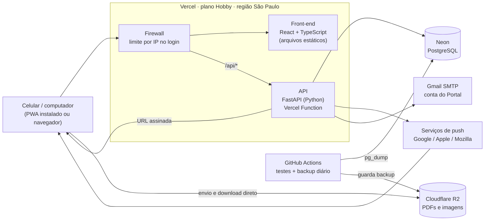

# 05 · Arquitetura — Entrega 1

| | |
|---|---|
| **Status** | v0.1 |
| **Autor** | Erick Santos Dantas |
| **Criado em** | 02/10/2026 |
| **Base** | `02-requisitos.md` v0.2, `04-modelo-de-dados.md` v0.1 |
| **Decisões** | `docs/adr/` (ADR-0001 a ADR-0008) |
| **Próximo documento** | `06-prototipo.md` |

---

## 1. Visão geral



**Um endereço só** (`*.vercel.app`) serve a tela e a API (`/api/...`). Com isso o cookie de sessão
fica no mesmo domínio, e não é preciso liberar acesso entre domínios (CORS).

**Arquivos não passam pela API.** A API confere a permissão e devolve uma URL assinada, válida
por poucos minutos, e o navegador envia ou baixa direto do R2. Isso é obrigatório: a Vercel
recusa requisições acima de 4,5 MB, e um anexo pode ter 10 MB.

## 2. Componentes

| Peça | Tecnologia | Por quê | ADR |
|---|---|---|---|
| Front-end | React + TypeScript + Vite, PWA (vite-plugin-pwa) | Mesma stack do trabalho; PWA dá instalação e notificação com um código só | 0001 |
| API | Python 3.12 + FastAPI + SQLAlchemy 2 + Alembic | Mesma stack do trabalho; backend é o ponto forte do autor e o foco do portfólio | 0001 |
| Hospedagem | Vercel Hobby, front e API no mesmo projeto | Grátis, deploy a cada `git push`, HTTPS automático | 0002 |
| Banco | Neon (PostgreSQL), plano Free | Postgres de verdade, grátis, não pausa o projeto por inatividade | 0003 |
| Arquivos | Cloudflare R2, bucket privado | 10 GB grátis, sem custo de download | 0004 |
| Login | Senha própria (Argon2id) + sessão em cookie | Decisão de conta por unidade com `mudar123` | 0005 |
| Notificação | Web Push (VAPID) + e-mail pelo Gmail | Push é grátis e nativo do PWA; e-mail é complemento | 0006 |
| Backup | GitHub Actions: `pg_dump` diário, cifrado, para um bucket R2 só de backups | O Neon grátis só guarda 6 h de histórico | 0007, 0009 |
| Domínio | `*.vercel.app`, sem domínio próprio | Decisão de custo zero (02/10/2026) | 0008 |

## 3. Organização do repositório

```
portal-capibaribe-prime/
├── docs/               ← estes documentos e os ADRs
├── web/                ← front-end React (PWA)
│   └── src/
├── api/                ← FastAPI
│   ├── app/
│   │   ├── rotas/      ← endpoints por assunto (acesso, avisos, enquetes, documentos, admin)
│   │   ├── servicos/   ← regras de negócio, sem saber de HTTP
│   │   ├── modelos/    ← SQLAlchemy
│   │   └── main.py
│   ├── migracoes/      ← Alembic
│   └── testes/
├── scripts/            ← carga inicial das 320 unidades, dados fictícios
├── .github/workflows/  ← testes e backup
└── vercel.json
```

## 4. Segurança

| Ameaça | Defesa | Onde |
|---|---|---|
| Alguém ativa contas de várias unidades com `mudar123` | Firewall da Vercel: **no máximo 20 tentativas de login por IP a cada 10 minutos**. Uma pessoa ainda consegue tomar algumas unidades (risco aceito), mas não o prédio inteiro em minutos. | ADR-0005 |
| Chute de senha numa unidade | Bloqueio de 15 min após 5 erros (RF-05) | Banco + API |
| Roubo de sessão | Cookie `HttpOnly`, `Secure`, `SameSite=Lax`; token guardado só como hash | ADR-0005 |
| Requisição forjada de outro site (CSRF) | `SameSite=Lax` + toda alteração exige um cabeçalho próprio que outro site não consegue enviar | ADR-0005 |
| Unidade comum acessar função de gestão | Permissão checada **no servidor** em toda rota de gestão (RNF-13), com teste para cada rota | API |
| Download de documento de gestão por link vazado | Bucket privado; URL assinada válida por 5 minutos, gerada só após checar permissão | ADR-0004 |
| Arquivo malicioso | Só PDF, JPEG, PNG e WEBP; tipo conferido pelo conteúdo, não pela extensão; arquivos servidos como download | ADR-0004 |
| Injeção de script em avisos | Texto do aviso é texto puro com quebras de linha (sem HTML); política de conteúdo (CSP) restritiva | Front + cabeçalhos |
| Apagar dado oficial (bug ou invasão) | Usuário do banco da aplicação **sem permissão de DELETE** nas tabelas oficiais | Banco (modelo, seção 4) |
| Senha ou chave no repositório | Segredos só nas variáveis de ambiente da Vercel e do GitHub; `.gitignore` bloqueia `.env` | Repositório |
| Dependência com falha conhecida | Dependabot do GitHub abre atualização automática | GitHub |

## 5. Limites gratuitos × uso esperado

Conferidos na documentação oficial em **02/10/2026**. Planos gratuitos mudam: revisar a cada
entrega.

| Serviço | Limite grátis | Uso estimado (E1) | Folga |
|---|---|---|---|
| Vercel · invocações de função | 1.000.000/mês | ~50 mil/mês (320 unidades × ~5 acessos/semana × ~8 chamadas) | Grande |
| Vercel · CPU ativa | 4 h/mês | ~30 min/mês (o hash de senha é o que mais pesa, e só no login) | Boa |
| Vercel · transferência | 100 GB/mês | < 2 GB/mês (arquivos não passam pela Vercel) | Grande |
| Vercel · duração da função | 300 s | Envio de push para ~1.000 aparelhos em paralelo: poucos segundos | Boa |
| Vercel · corpo da requisição | 4,5 MB | Arquivos vão direto ao R2 | Contornado |
| Vercel · regra de limite por IP | 1 regra, 1 milhão de requisições | 1 regra (login) | No limite: **só sobra para o login** |
| Neon · armazenamento | 1 GB por projeto | < 100 MB em 2 anos | Grande |
| Neon · computação | 100 CU-hora/mês, desliga após 5 min parado | ~20 CU-hora/mês | Boa |
| Neon · histórico para restaurar | 6 horas | — | **Insuficiente → backup próprio (ADR-0007)** |
| R2 · armazenamento | 10 GB | 1 a 3 GB em 2 anos + backups (~1 GB) | Boa |
| R2 · operações | 1 mi escrita / 10 mi leitura por mês | milhares | Grande |
| Gmail · envio | ~500 e-mails/dia | No pior caso, um aviso para todas as unidades com e-mail: ≤ 320 | Boa, com atenção |

**Ponto fraco conhecido:** quando o Neon "acorda" depois de 5 minutos parado, a primeira
requisição demora mais (geralmente menos de um segundo). Com uso esporádico, isso vai acontecer
bastante. É aceitável para avisos e enquetes.

## 6. Fluxos principais

### 6.1 Primeiro acesso (H-01)
1. Tela envia `1101` + `mudar123` para `POST /api/acesso/entrar`.
2. Firewall conta a tentativa do IP. A API normaliza o login, confere bloqueio e senha.
3. Como `precisa_trocar_senha = true`, a API cria a sessão **restrita**: só permite
   `POST /api/acesso/primeiro-acesso`.
4. A pessoa envia nova senha, nome e celular (e e-mail opcional). A API grava, marca
   `ativada_em`, registra no histórico e libera a sessão completa.

### 6.2 Publicar aviso com anexo (H-12, H-13)
1. A tela pede `POST /api/arquivos/upload` com nome, tipo e tamanho; a API confere o papel e
   devolve uma URL assinada de envio.
2. A tela comprime a imagem (se for imagem) e envia direto ao R2.
3. A tela envia o aviso (`POST /api/avisos`) com a referência do arquivo. A API confere que o
   arquivo existe, grava aviso + versão 1 + anexos numa transação e registra no histórico.
4. A API envia o push para as inscrições das unidades do destino, em paralelo, e os e-mails
   em seguida. Inscrição que o serviço de push diz não existir mais é removida.

### 6.3 Votar (H-21)
1. `PUT /api/enquetes/{id}/voto` com as opções.
2. A API confere destino e papel; o banco garante prazo e um voto por unidade (trigger e PK).
3. Numa transação: grava/atualiza `voto` e troca as linhas de `voto_opcao`.

## 7. Ambientes

| Ambiente | Onde | Banco | Dados |
|---|---|---|---|
| Local | Computador do autor | PostgreSQL em Docker | Fictícios |
| Prévia | Vercel cria um endereço para cada branch | Branch do Neon criado da produção **sem dados pessoais** (só estrutura) | Fictícios |
| Produção | `*.vercel.app` | Neon, branch principal | Reais |

## 8. Qualidade

- **Testes:** pytest na API (cada critério de aceite das histórias vira teste), Vitest no front.
  Testes de API rodam contra um Postgres de verdade (container no GitHub Actions), porque várias
  regras moram no banco.
- **Integração contínua:** a cada push, GitHub Actions roda lint, testes e confere se as
  migrações aplicam do zero. Deploy de produção só a partir da branch `main`.
- **Registro de erros:** os logs da Vercel no plano grátis duram só **1 hora**. Erros da API são
  gravados na tabela `erro` (modelo de dados, seção 3.6), sem dado pessoal, visível no painel
  do administrador e apagada após 90 dias.

## 9. Riscos técnicos

| Risco | Mitigação |
|---|---|
| Vercel, Neon ou R2 mudarem o plano gratuito | Tudo é padrão (Postgres, S3, ASGI): dá para migrar sem reescrever. Revisar limites a cada entrega. |
| iPhone só recebe push com o Portal **instalado na tela inicial** (iOS 16.4+) | Tela de instalação com passo a passo para iPhone; e-mail como reserva; aviso também no grupo nas primeiras semanas |
| Gmail bloquear a conta por volume ou parecer spam | Volume baixo (≤ 320/dia); e-mail é opcional; push é o canal principal |
| Endereço `vercel.app` parecer golpe para morador | Divulgar o link pela Comissão, no grupo, com print da tela; fixar a mensagem |
| Plano Hobby é só para uso **não comercial** | O Portal não cobra, não tem anúncio e ninguém é pago para fazê-lo: está dentro da regra. Se a administração do condomínio um dia pagar pelo sistema, migra para o plano Pro. |
