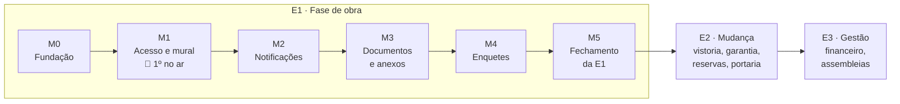

# 07 · Roadmap — Portal Capibaribe Prime

| | |
|---|---|
| **Status** | v0.6 — M0 e M1 fechados (M1 anunciado no grupo em 06/10/2026); M2 no ar como versão 1.2.0 (06/10/2026), falta o teste em aparelho; sem prazos; documento vivo: muda a cada marco fechado e a cada opinião do grupo |
| **Autor** | Erick Santos Dantas |
| **Criado em** | 04/10/2026 |
| **Base** | `02-requisitos.md` v0.2, `03-historias.md` v0.1, `05-arquitetura.md` v0.1, `06-prototipo.md` v0.2 |
| **Próximo passo** | Versão 1.3.0 com as respostas do Erick (`superpowers/duvidas-m2.md`, fim); teste do M2 em Android e iPhone reais; fechar o M2 |

---

## 1. Como ler

O roadmap é uma **sequência de marcos**, não um calendário. Cada marco termina com algo
**no ar ou verificável**, e só se começa o seguinte quando o anterior fechou.

**Sem prazo nem estimativa de tempo** (decisão de 04/10/2026): o ritmo é livre. O que mantém o
projeto seguro é o marco ser **pequeno e útil sozinho**: se tudo parar depois dele, o que já
está no ar continua servindo.

Cada marco tem:

- **Entra:** as histórias (`03-historias.md`) e o trabalho técnico.
- **Fica de fora:** o que parece caber, mas foi empurrado de propósito, e por quê.
- **Pronto quando:** o critério objetivo para fechar o marco.

## 2. Princípios

1. **Produção desde o primeiro marco.** O M0 já sobe um endereço de verdade na Vercel, com banco
   e deploy automático. Infraestrutura que só aparece no fim esconde os problemas até o fim.
2. **Cada marco útil sozinho** (`02-requisitos.md`, seção 1). Por isso a fatia 1 das histórias
   foi dividida em dois marcos (M1 e M2): sem notificação, o mural já é o registro oficial.
3. **Critério de aceite vira teste** (`03-historias.md`, seção 1). Marco com critério sem teste
   não fecha.
4. **O protótipo é a referência de tela.** O app é escrito do zero em React (ADR-0001), mas
   cada tela começa pela do protótipo, que já foi testado com vizinhos e revisado.
5. **Histórias de E2 e E3 só quando a entrega começar.** Escrever antes seria adivinhar um
   prédio que ainda não existe.
6. **Opinião do grupo entra a qualquer momento**, como ajuste no marco em andamento ou no
   próximo. Mudança grande (de regra, não de tela) volta para os requisitos primeiro.

## 3. Visão geral

| Marco | Resumo |
|---|---|
| **M0** ✅ | Esqueleto: repositório, CI, Vercel + Neon, banco com as 320 unidades |
| **M1** ✅ | Entrar, primeiro acesso, mural de avisos e painel de adesão. **Primeiro uso real**, anunciado em 06/10/2026 |
| **M2** | Notificação no celular, e-mail e "esqueci a senha" |
| **M3** | Documentos e anexos nos avisos (Cloudflare R2) |
| **M4** | Enquetes com um voto por unidade |
| **M5** | Acessibilidade real, ajustes, medição e balanço da E1 |
| **E2** | Histórias escritas quando a entrega se aproximar; código antes das chaves |
| **E3** | Depois da primeira assembleia |

---

## 4. E1 · Fase de obra

### M0 · Fundação

Nenhuma tela de morador. O objetivo é o caminho inteiro funcionando de ponta a ponta, vazio.

**Entra:**
- Pastas `web/` e `api/` na estrutura da arquitetura (seção 3), com React + TS (Vite) e
  FastAPI + SQLAlchemy + Alembic.
- Pre-commit ganha ruff (Python) e eslint + tsc (TypeScript) já no primeiro commit de código.
- GitHub Actions: lint, testes contra um Postgres de verdade e "as migrações aplicam do zero".
- Projeto na Vercel (front + API, região gru1) e banco no Neon, com deploy a cada push na `main`.
- Migração inicial com as tabelas de acesso (`bloco`, `unidade`, `unidade_papel`,
  `sessao`, `historico`, `erro`) e as permissões do usuário do banco (sem DELETE no que é oficial).
- Carga inicial: 5 blocos, 320 unidades, papel de admin (`04-modelo-de-dados.md`, seção 7). A
  unidade real do admin entra por variável de ambiente, nunca no código (o repositório é público).
- Script de dados fictícios para desenvolvimento (RNF-16).
- Tabela `erro` gravando exceções da API (os logs grátis da Vercel duram 1 hora).

**Fica de fora:** qualquer tela além de uma página "no ar" e uma rota `/api/saude`.

**Pronto quando:** um push na `main` passa no CI e publica sozinho; `/api/saude` responde com o
número de unidades lido do Neon (320); um erro forçado aparece na tabela `erro`.

**✅ Fechado em 04/10/2026.** No ar em https://portal-capibaribe-prime.vercel.app (`/api/saude`
responde 320, atendido em `gru1`). Os três critérios foram conferidos em produção. A revisão
independente (código e segurança) achou 10 problemas, todos corrigidos com teste de regressão;
entre eles, o CI apontava para uma versão de action que não existe e o usuário `app` conseguia
forjar o login de uma unidade com uma tabela temporária. Spec, plano e decisões técnicas em
`docs/superpowers/` (`duvidas-m0.md`).

### M1 · Acesso e mural · 🚀 primeiro no ar

O menor Portal que já resolve algo: **o aviso oficial ganha um endereço que não se perde no
grupo**. A Comissão publica no Portal e manda o link no grupo; quem abre fica sabendo, e o
aviso continua lá depois.

**Entra:**

| Épico | Histórias |
|---|---|
| A · Acesso | H-01 primeiro acesso · H-02 entrar · H-03 bloqueio · H-06 minha unidade (inclui apagar dados) |
| B · Administração | H-07 painel de ativação · H-08 resetar · H-09 papel de Comissão · H-11 histórico |
| C · Avisos (só texto) | H-12 publicar · H-14 mural · H-15 corrigir/arquivar · H-16 quem leu |

E também: layout de celular e de computador, tema claro/escuro (como no protótipo) e a
**política de privacidade** visível antes do primeiro acesso (RNF-11).

**Fica de fora, de propósito:**

| O quê | Por quê | Vai para |
|---|---|---|
| Notificação (H-05, H-13) | Push exige service worker, chaves VAPID e o passo a passo do iPhone. Sem ela, o link no grupo cumpre o papel no começo. | M2 |
| Esqueci a senha por e-mail (H-04) | Depende do envio de e-mail. Até lá vale a resposta que a história já prevê para quem não tem e-mail: "fale com a administração", e o admin reseta (H-08). | M2 |
| Anexos nos avisos | Depende do envio direto ao R2 com URL assinada, que nasce junto com documentos. | M3 |
| Corrigir blocos e unidades (H-10) | A carga inicial já cria as 320. Só é preciso editar se a convenção disser outra coisa. | M5 |

**Portão antes de abrir para o grupo** (nada de dado real antes disso):

1. ✅ Backup diário rodando **e uma restauração testada** (ADR-0007, ADR-0009, RNF-21). O backup
   vai para o R2, num bucket só de backups, então a conta da Cloudflare nasce aqui, antes dos
   documentos. Primeiro backup real e primeira restauração no Actions em 06/10/2026 (5 blocos,
   320 unidades e a migração conferidos); daí em diante, todo dia às 03:00 e restauração no dia 2.
2. ✅ Regra de firewall da Vercel: 20 logins por IP a cada 10 minutos (ADR-0005), publicada em
   05/10/2026.
3. ✅ Testes de permissão: toda rota de gestão recusa a conta comum (RNF-13), conferido pela lista
   de rotas do próprio OpenAPI.
4. ✅ Revisão independente (UX + código), como foi feita no protótipo: 7 achados de código e 11
   de UX, todos corrigidos com teste de regressão (migração 0003), no ar em 06/10/2026.
5. ⏭️ Ensaio com 2 ou 3 vizinhos e 1 membro da Comissão, em produção, antes do anúncio no grupo.
   **Pulado por decisão do Erick (06/10/2026):** ninguém se dispôs a tempo; o grupo já tinha
   testado o protótipo e a parte técnica do portão estava cumprida. Abriu direto e corrige
   conforme as pessoas entram.
6. 🟡 A Comissão concorda em publicar avisos pelo Portal. A Comissão estava parada; um membro
   entrou e recebeu o papel no dia do lançamento. O uso real passa a ser medido pelo critério de
   sucesso "a Comissão usa o Portal" (seção 6), não mais como portão.

**Pronto quando:** todos os critérios de aceite das histórias acima passam como teste, o portão
está cumprido e o link foi anunciado no grupo.

**Onde está (06/10/2026):** os três épicos, a revisão e as decisões de fim de marco estão em
produção (649 testes na API, 174 no front). O admin já fez o primeiro acesso e o primeiro aviso
real (boas-vindas, fixado, para todos) está no mural. Decisões de fim de marco (dono do projeto):
a Comissão **vê os contatos** das unidades, só para leitura (resetar, papéis e histórico seguem
só do admin); dar ou tirar o papel de Comissão pede confirmação; a política de privacidade nomeia
o responsável pelos dados. Registro em `docs/superpowers/duvidas-m1.md`, seção "Fim do marco".
Falta só o que é de gente: os itens 5 e 6 do portão e o anúncio.

**Fora do roteiro, no mesmo dia (06/10/2026):** avisos com formatação (subtítulo, negrito, listas,
destaque), categoria (Geral, Obra, Reunião, Financeiro, Urgente) e evento (Quando/Onde), migração
0004 — pedido do Erick depois de ver o primeiro aviso real como texto corrido. Spec em
`docs/superpowers/specs/2026-10-06-avisos-visual-design.md`. O Erick também decidiu não esperar
o ensaio para abrir: libera para o grupo e corrige conforme as pessoas entram (registrar a data
do anúncio aqui).

**✅ Fechado em 06/10/2026:** link anunciado no grupo de WhatsApp dos compradores com a senha
inicial e o pedido de retorno; um membro da Comissão ativou a conta e recebeu o papel. No
lançamento: 2 unidades ativadas, 0 erros em produção. A meta de adesão (seção 6) conta a partir
desta data: 40% em 3 meses, e menos de 20% em 3 meses é o sinal para parar e perguntar.

**Primeiro dia (06/10/2026, noite):** 23 unidades ativadas (7,2% das 320) nos 5 blocos
(Bloco 1: 7 · Bloco 2: 7 · Bloco 3: 5 · Bloco 4: 2 · Bloco 5: 2), 8 leituras do aviso de
boas-vindas, 0 erros em produção. Um morador relatou "senha incorreta" e conseguiu entrar na
tentativa seguinte. No mesmo dia saíram as versões 1.1.0 (logo, ícone, janela "O que mudou") e
1.1.1 (logo no menu lateral); o histórico para o morador fica em `web/src/sobre/novidades.ts`.

### M2 · Notificações

**Entra:** H-05 instalar e ativar notificações · H-13 ser avisado (push e e-mail) · H-04
esqueci a senha. Conta Gmail do Portal (ADR-0006, ADR-0008) e PWA instalável.

**Pronto quando:** um aviso para o Bloco 1 chega em um Android e em um iPhone com o Portal
instalado, e não chega no Bloco 2; o link de recuperação expira em 1 hora e só funciona uma vez.

**Atenção:** iPhone só recebe push com o Portal instalado na tela inicial (iOS 16.4+). Testar
num iPhone de verdade antes de fechar; se ninguém da família tiver, pedir a um vizinho.

### M3 · Documentos e anexos

**Entra:** H-17 publicar documento · H-18 consultar (inclusive os públicos na tela de entrada)
· H-19 nova versão · anexos de imagem e PDF nos avisos (H-12, parte que ficou de fora).
Bucket privado no Cloudflare R2 com URL assinada (ADR-0004), compressão de imagem no envio.

**Pronto quando:** documento de nível "gestão" não aparece nem baixa por link direto para conta
comum; arquivo com extensão trocada (um `.exe` renomeado para `.pdf`) é recusado.

**Decidir neste marco:** o backup da ADR-0007 cobre só o banco, não os arquivos no R2. Antes de
subir o primeiro documento real, definir como os arquivos ficam protegidos contra perda (nova
ADR).

### M4 · Enquetes

**Entra:** H-20 criar enquete · H-21 votar · H-22 ver resultado. As regras que o banco garante
(um voto por unidade, nada de voto depois do prazo, nada de editar depois do 1º voto) ganham
teste que tenta burlar cada uma direto no banco.

**Pronto quando:** dois celulares da mesma unidade votando ao mesmo tempo resultam em um voto
só; a primeira enquete real da Comissão roda no Portal.

### M5 · Fechamento da E1

**Entra:**
- H-10 corrigir blocos e unidades.
- Teste com leitor de tela de verdade (TalkBack e VoiceOver) e fonte ampliada pelo sistema,
  que o protótipo não cobriu (`06-prototipo.md`, seção 4).
- Medição dos critérios de sucesso (seção 6) e revisão dos limites gratuitos contra o uso real.
- Balanço da E1: o que o grupo usou, o que ninguém usou e o que precisa mudar antes da E2.

**Pronto quando:** o balanço está escrito e decide o que vai para a E2.

---

## 5. Depois da E1

### E2 · Mudança e dia a dia

Começa quando a E1 fechar ou quando a construtora anunciar a vistoria ou a data de entrega, o
que vier primeiro. O primeiro passo é escrever as histórias da E2, com o prédio já quase pronto.

**Ordem proposta**, pelo que pesa no dia da entrega:

1. **Vistoria e garantia** (RF-50 a RF-54). Na entrega, o assunto de todo mundo são os defeitos
   do apartamento. Registrar a pendência com foto e data, e acompanhar a resposta da construtora,
   é o que mais ajuda nos primeiros meses e o que dá mais força na cobrança (visão, seção 3).
2. **Troca da Comissão pela gestão eleita** (RN-06): o papel passa para o síndico e o conselho.
3. **Reservas** (RF-40 a RF-44), quando se souber quais áreas foram entregues de fato.
4. **Encomendas e visitantes** (RF-60 a RF-63), quando houver portaria funcionando.

### E3 · Gestão

Depende da primeira assembleia e de a gestão eleita (ou a administradora, se houver) querer usar
o Portal. Ordem proposta: **financeiro** (RF-70 a RF-74, objetivo O2: transparência é a maior
desconfiança em condomínio novo), **assembleias** (RF-80 a RF-82), **operação** (RF-90 a RF-94).

Questões da visão que só se resolvem aqui: haverá administradora? Votação com valor legal entra
ou não?

---

## 6. Critérios de sucesso

Completa a seção 11 da visão, que deixou os percentuais para este documento. Base: 320 unidades.
Os números são um primeiro chute, revisados no balanço do M5.

| Critério | Meta | Quando medir |
|---|---|---|
| Unidades ativadas | **40%** (128) em 3 meses após o anúncio; **60%** (192) em 6 meses | Painel de ativação (H-07) |
| A Comissão usa o Portal | Pelo menos 1 aviso por mês publicado pelo Portal | Histórico (H-11) |
| Avisos chegam | Aviso médio lido por metade das unidades ativadas em 7 dias | "Quem leu" (H-16) |
| Enquetes participativas | Participação média acima de 30% das unidades do destino | Resultado (H-22) |
| Custo | R$ 0 por mês | Painéis da Vercel, Neon e R2 |
| Backup confiável | Restauração testada todo mês, sem falha | Registro do teste (ADR-0007) |
| Dado pessoal | Nenhum vazamento; nenhum dado além do inventário (`04-modelo-de-dados.md`, seção 5) | Revisão no M5 |

**Sinal para parar e repensar:** se em 3 meses a adesão ficar **abaixo de 20%**, os marcos
seguintes param até se entender o motivo, perguntando no grupo. Construir documentos e enquetes
para um Portal que ninguém abre seria desperdício.

## 7. Riscos do roadmap

| Risco | Mitigação |
|---|---|
| O projeto parar no meio (o maior risco, visão seção 10) | Marcos pequenos e úteis sozinhos; o M1 já entrega valor. Parou depois do M1, o mural continua no ar. |
| A Comissão não topar publicar pelo Portal | É item do portão do M1: conversar antes de construir o resto. Sem Comissão, a E1 vira só portfólio, que ainda cumpre o O4. |
| Plano gratuito mudar no meio do caminho | Revisar limites no fim de cada marco (arquitetura, seção 5). Tudo é padrão (Postgres, S3), migra sem reescrever. |
| Opinião do grupo pedir mudança grande | Mudança de regra volta para os requisitos antes do código; mudança de tela entra no marco em andamento. |

## 8. Acompanhamento

- Cada marco vira um **milestone no GitHub**, com uma issue por história. O progresso fica
  público, o que também serve ao portfólio (objetivo O4).
- Ao fechar um marco: atualizar a tabela da seção 3 e o README, e registrar o que mudou neste
  documento (versão no cabeçalho).
